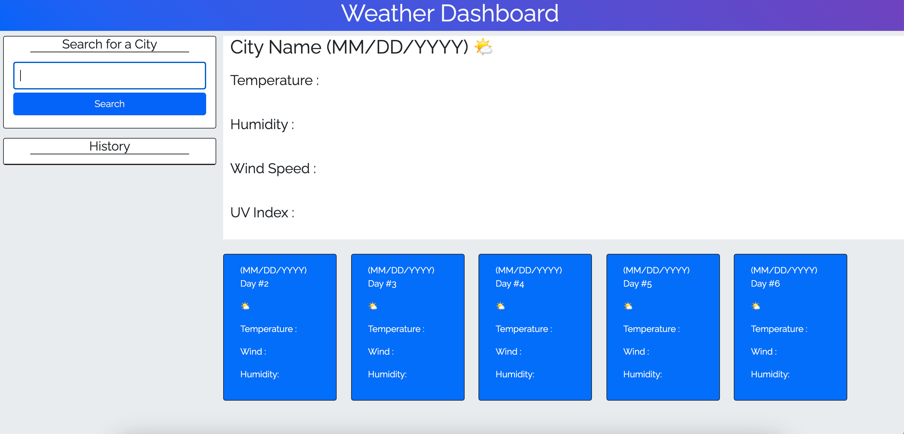

# Weather Dashboard

## Description

- The Weather Dashboard web application allows the user to search the weather for city input in the search box. The search results in the current weather which includes the Current Date (MM/DD/YYYY), Temperature(Fahrenheit), Icon of Weather, Wind Speed, Humidity, and UV Index. In addition to the current weather forecast being displayed, the next five days will also be displayed right below the current weather. The next (5)Days will display the Date, Icon, Wind, and Humidity.

## Screenshot

## Website

- https://kevin-hernandez-garza.github.io/weatherDashboard/

### Made with 💙 by Kevin Hernandez
